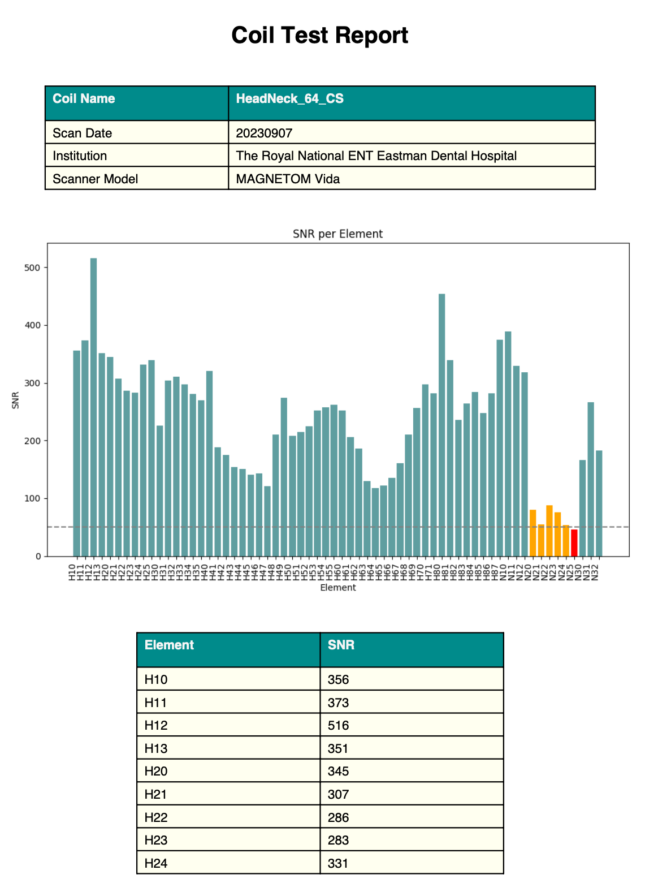
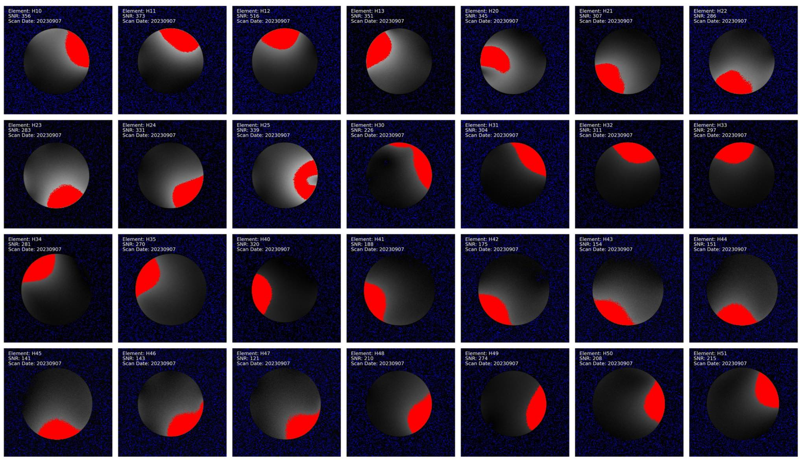
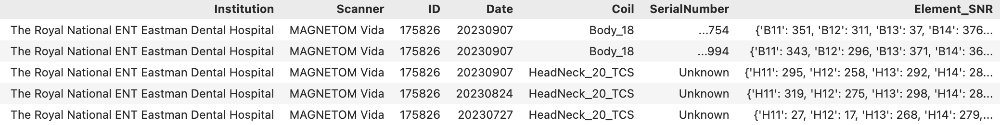

# Coil QA Testing Process (WIP): 

This Coil QA testing process has been devised to monitor the integrity and performance of RF coils  used for MRI. It provides a snapshot of the coil performance at the time of testing, which can be used as a reference data-point of the coil's 'health' at any given time, or longitudinally when tests are run on a regular basis, e.g. yearly.


## Primary method: *element-wise SNR*
The test calculates the SNR from each of the active elements that constitute the RF coil. The SNR value is obtained as the ratio between the average intensity of the 5% brightest and darkest voxels (excluding zeros) in the image. Compared to a multi-element image based analysis, this method has the following benefits and drawbacks:

 **Benefits**:
   - **Element-wise testing**: The SNR is calculated for every coil-element, which greatly enhances the sensitivity of the test and provides the granularity to assess the ‘health’ of each of the individual coil elements. 

 - **Avoidance of location-based ROI selection**:  Since the MR signal is captured by a single element, one can avoid the use of location based ROIs for the analysis, which is hard to control and can introduce inconsistencies. Instead, the adopted voxel-intensity-percentile-based approach ensures a consistent calculations of the SNR.


- **Automation**: The lack of ROIs allows for a highly automated process regardless of the coil geometry, thereby reducing manual input and the associated errors.

- **Guidance from Siemens**: The images used in this QA process are acquired using Siemens’ ‘Customer QA’ testing suit, which is accompanied by detailed instructions on how to position the phantoms for every coil tested. This guidance ensures that the process remains standardised and reproducible.


**Drawbacks**:
* The current implementation is for Siemens scanners only. Implementation for Philips scanners needs more thought. (i.e to find out how to obtain single active-element images or consider using multi-element image based analysis for Philips scanners).
* No control over the image acquisition parameters, as the ‘Customer QA’  acquisitions have fixed parameters which cannot be modified.


---

## Current implementation of the Element-wise SNR using Python:
## What the script does: 
   - Calculates the Signal-to-Noise Ratio (SNR) of each element in the RF Coil.
   - Generates a report with the results of the tests.
   - Creates (or updates) an entry with the test results to a SQLite database for future reference.

### Input:
   - Directory containing the DICOM files with the Customer Service QA data. 

### Output:
   - A report in PDF format summarising the analysis.
   - An SQLite database storing the results.
   - (Additional outputs used in PDF the report: 
     - Overlay images highlighting the brightest and darkest pixels for SNR calculation.
     - A CSV file containing a summary of the results.
     - A bar chart visualising the SNR per coil element.)

### Execution:
 - Use the command-line interface to call the script and specify the path to the data folder and, optionally, the output folder e.g.:  
 
 ```python ServiceQA_analysis.py /CoilTests/H64CH_CustomerQA_07Sep2023 --out_folder <results_folder>```
 
 will create the output folder inside the specified results_folder. If the output folder is not provided, it will be created inside the input folder.

 - The script will process the data, generate visualisations, create a report, and update the database.

### Dependencies:
   - Libraries: argparse, pathlib, os, pydicom, numpy, pandas, matplotlib, fpdf, PIL, sqlite3.
     
     


---
***Example report:***



  

---
## Script structure:


   a. **DICOM File Analysis**:
      - Iterate through all DICOM files in the given path.
      - For each DICOM file, extract relevant tags (such as Institution, Scanner, ID, Date, Coil, and Element).
      - Compute the SNR for each image and slice.
      - Save overlay images highlighting the brightest and darkest regions to illustrate of the SNR calculation process. 
      - Populate the results in a DataFrame for further processing.
      
   b. **Data Cleaning**:
      - Retain entries with the highest SNR for each coil element. (Since for every element, 2 separate images at different Z-position are acquired).
      - Clean unnecessary images from the output directory, keeping only those relevant to the final report.
      
   c. **Visualisation**:
      - Create a bar chart to visualise the SNR for each coil element. Bars representing SNR values below the threshold (e.g., 50) are highlighted in red. Bars representing SNR values below the twice threshold are highlighted in yellow.
      - Generate a collage of the overlay images of every element.
      
   d. **Report Generation**:
      - Generate a PDF report that includes:
        - General information (Coil Name, Scan Date, Institution, Scanner Model).
        - The SNR bar chart.
        - A table listing the SNR for each coil element.
        - The collage image of all the coil elements. 
      
   e. **Database Update**:
      - Check if the SQLite database table exists.
      - If it exists, for each row in the CSV:
        - If a matching record (based on ID, Date, and Coil) exists in the database, update the record.
        - If no match is found, insert the new record.
      - If the table doesn't exist, create it and populate it with data from the CSV.



***Notes***:
   - The SQLite database is a lightweight solution for storing and querying results. Make regular backups.
   - The default threshold for highlighting SNRs in the bar chart is set to 50 but can be adjusted as per requirements.


